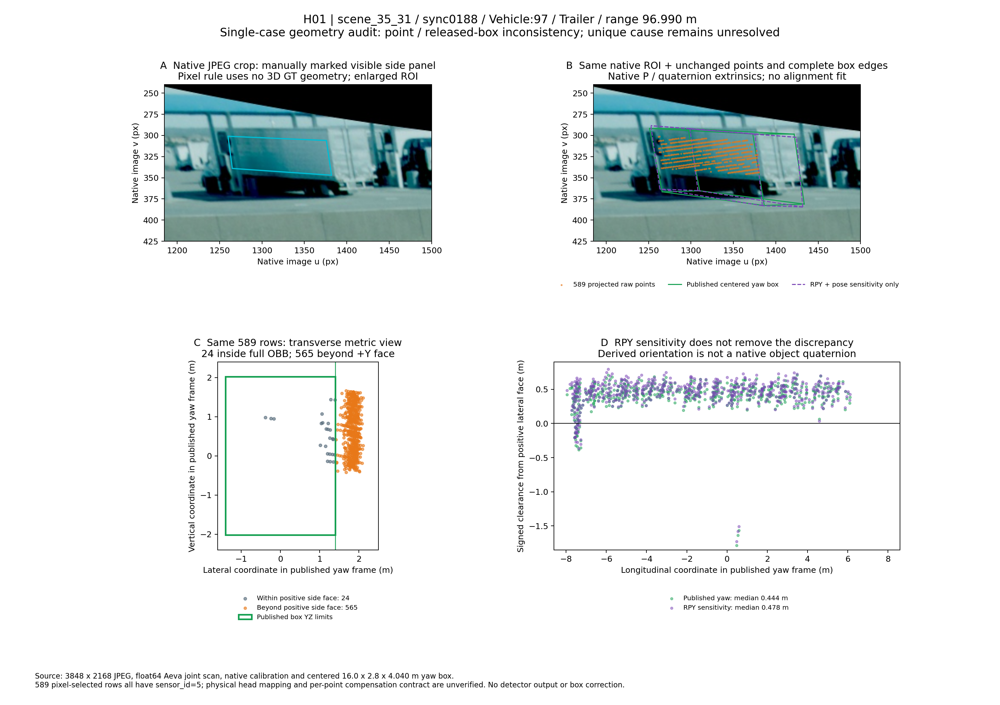
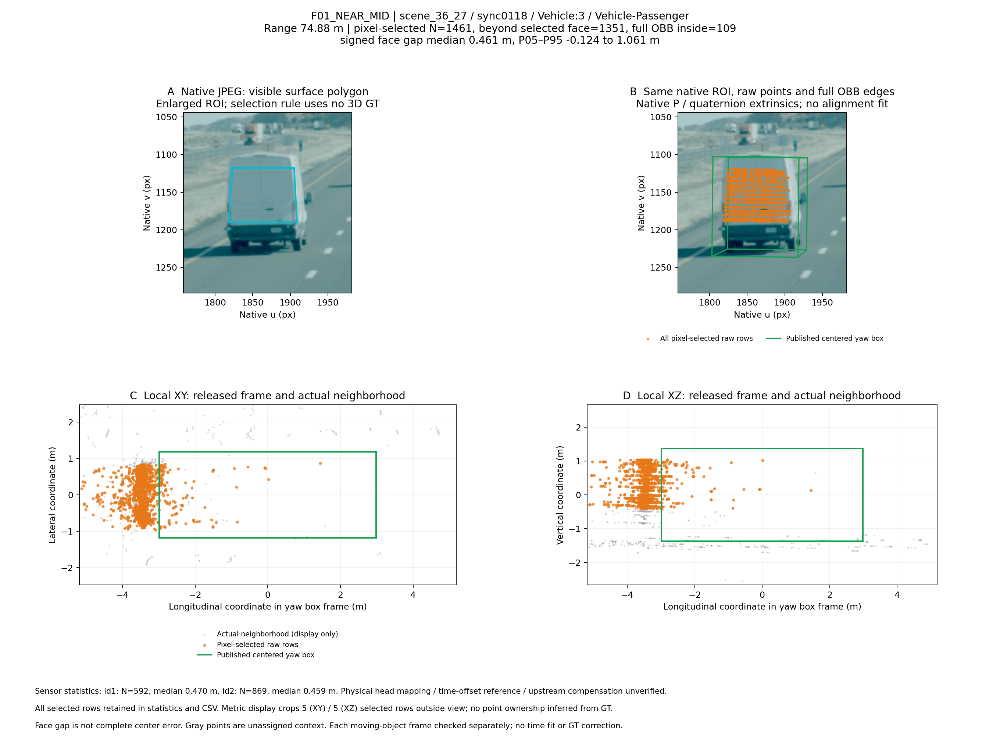
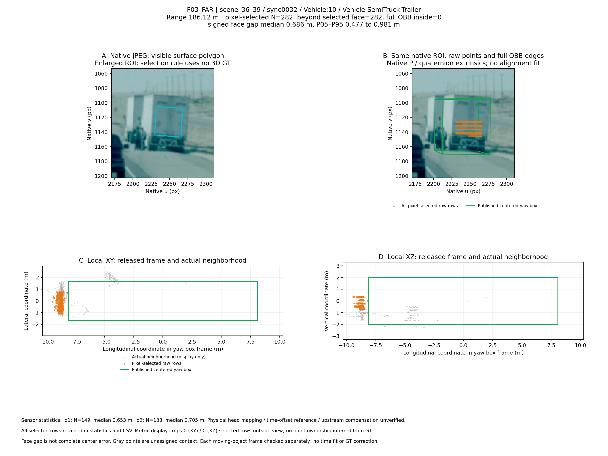
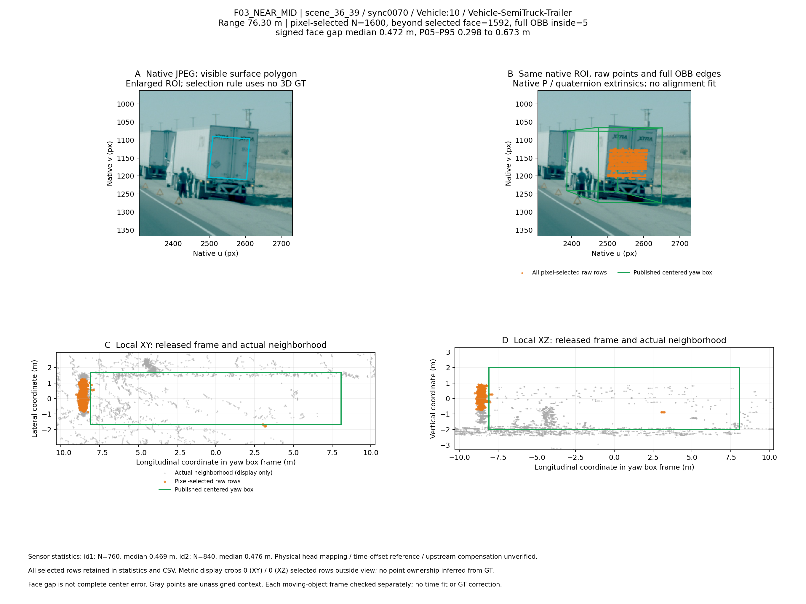

# TruckDrive box–surface evidence package

Can the released coordinate, timing, compensation and GT-enclosure contracts explain the fixed visible-surface discrepancies below? This independent evidence package presents three objects in four main frames, with the weaker and partially consistent cases retained. It requests a publisher reference-pipeline check; it does not establish which component caused the discrepancies.

[Read the report (PDF)](reports/Evidence_Report.pdf) · [Editable report](reports/Evidence_Report.md) · [31-page evidence atlas](reports/Evidence_Atlas.pdf) · [Complete correspondence](data/correspondence.csv) · [Methods and limits](METHODS.md)

## Main observations

Positive signed clearance means beyond the named GT face. These medians are surface-to-face distances, not object-center errors.

| Case | Scene / native object / sync | Range XY (m) | Fixed points / beyond face | Face | Median clearance (m) | Atlas |
|---|---|---:|---:|---|---:|---|
| H01 | scene_35_31 / Vehicle:97 / 0188 | 96.99 | 589 / 565 | +Y side | +0.443503 | pp. 2–3 |
| F01 | scene_36_27 / Vehicle:3 / 0118 | 74.88 | 1461 / 1351 | -X rear | +0.461251 | pp. 5–6 |
| F03 far | scene_36_39 / Vehicle:10 / 0032 | 186.12 | 282 / 282 | -X rear | +0.685512 | pp. 7–8 |
| F03 near | scene_36_39 / Vehicle:10 / 0070 | 76.30 | 1600 / 1592 | -X rear | +0.472415 | pp. 9–10 |

### H01: trailer sidewall



The formal 589-point image-panel rule is independent of GT membership. The historical GT-dependent 794-point corridor is a separate set. Purple RPY geometry is sensitivity only; green is the formal yaw box.

### F01: visible van rear



The native subtype is Vehicle-Passenger; the visible vehicle is described as a van. All fixed image-polygon returns are retained, including tail/background returns. This is not a certified pure body-point set.

### F03: same native trailer, two frames





Far and near measurements are separate. Stationary status is unverified. The near right-front candidate view remains N/A for independent confirmation of the same rear surface (atlas p. 11).

## Scope and interpretation

The atlas retains **14 object identities / 21 object-frames / 20 distinct captures**. It includes supplementary N04, partially consistent F04, and sparse, mixed, occluded or attribution-limited H02, F02, N01–N03 and C01/C02/C05/C06. Page repetition adds no cases. This post hoc selection is not representative sampling and cannot provide a dataset error rate.

Native identities, GT 7D values, source-file names/SHA and the existing fixed selections are traceable. Publisher-release identity and the cause—GT parameters, reference times, compensation, calibration or imaging pipeline—remain unresolved. Evaluation effects under strict 0.5–2 m matching thresholds have not been quantified. No timing argument assumes a stationary trailer. Historical detector candidates are auxiliary; query indices are not cross-model physical identities. Zero GT-OBB points do not mean an unobserved neighborhood.

## Public contents and data availability

The repository publishes the English report and atlas, four existing derived figures, compact case/metric tables, source-file identities and SHA, and **15,696 saved index rows across 20 groups**. The index table contains no point XYZ, intensity, velocity, timing, UV or sensor data. C05 display IDs are explicitly not original BIN row indices. The 21-row case table contains the necessary native 7D tuples, not complete annotation records; no full calibration is included.

Original JPEG/BIN, full annotation/calibration files and the source-asset ZIP are kept outside this public repository. This is a publication choice, not an additional restriction on recipients' rights under the dataset license. Obtain released source files through the [official dataset access route](https://torc-ai.github.io/TruckDrive/) subject to its terms, or a separately authorized nonpublic transfer. No nonpublic transfer or private link has been created for this repository. There is no direct authenticated download URL for the exact locally held files; local multi-copy SHA agreement does not authenticate publisher release/version.

## Offline quickstart

Python 3.9+ and the standard library are sufficient. The script uses no network, model, detector, GPU or service.

```sh
python3 scripts/verify_evidence.py
```

This validates public-file SHA, case/metric references and fixed-index group structure. To check source-file identities and the four principal fixed XYZ row sets, place the **20 matching source files** identified as `source_held_for_local_verification=True` in [source_assets.csv](data/source_assets.csv) under an external `TruckDrive` root, preserving `scene_*/...` hierarchy:

```sh
python3 scripts/verify_evidence.py --source-root /path/to/TruckDrive
```

The external check verifies source bytes, four native annotation identities/7D tuples, and concatenated original XYZ-byte hashes. Missing/mismatched files produce a failure with an exact path. It does not recompute scientific medians or certify the physical ownership of returns. [METHODS.md](METHODS.md) supplies the original geometric formulas, selection limits and the boundary of this verifier. Historical scientific scripts are provenance references, not an included end-to-end rendering pipeline.

`SHA256SUMS.txt` covers every public deliverable except itself. The Git commit identifies the manifest. Source provenance hashes and public-file hashes serve different purposes; see [rights and provenance](RIGHTS_AND_PROVENANCE.md).

## Attribution and terms

TruckDrive, provided by Torc Robotics, Inc., available at torc-ai.github.io/TruckDrive, used under the Torc Robotics Non-Commercial License v1.0.

Copyright (c) 2026 TORC ROBOTICS, INC. All rights reserved.

Dataset-derived material is shared for non-commercial research under the [full dataset license](https://torc-ai.github.io/TruckDrive/LICENSE-NONCOMMERCIAL.txt), including its [AS-IS/AS-AVAILABLE warranty disclaimer](https://torc-ai.github.io/TruckDrive/LICENSE-NONCOMMERCIAL.txt) and [publisher notice](https://torc-ai.github.io/TruckDrive/NOTICE.txt). Derived images contain camera crops, projected boxes, selected-point views and English scientific captions; the existing figure pixels and scientific values were not edited for this publication. No association, sponsorship, approval or endorsement by Torc Robotics or the dataset authors is claimed. No repository-wide MIT or other license is applied to dataset-derived assets. [Dataset citation](CITATION.bib) is transcribed from the official project page; consult the publisher's required CITATION.cff for academic publication.
